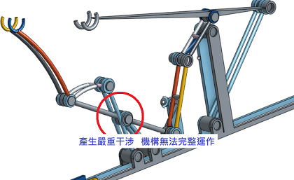
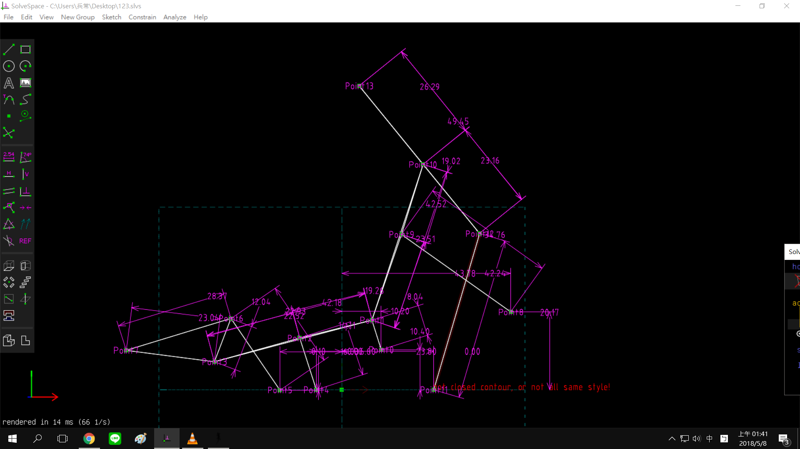
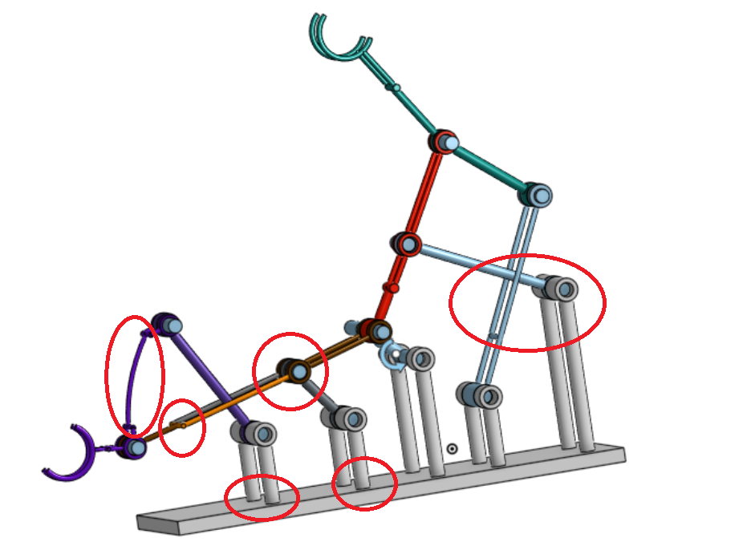
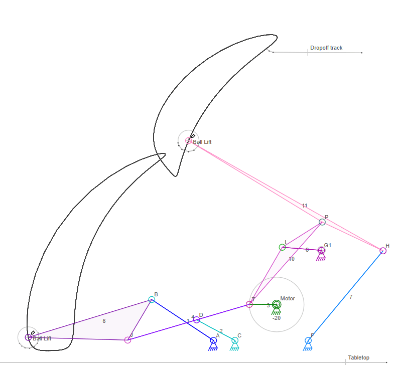

# W10 兩段式六連桿提球機構設計與模擬 {#w10-兩段式六連桿提球機構設計與模擬}

[影片](https://www.youtube.com/watch?v=pcwqpDsdXRc&feature=youtu.be)

[檔案](https://github.com/s40523141/cd2018/blob/gh-pages/%E5%8D%94%E5%90%8C%E7%94%A2%E5%93%81%E8%A8%AD%E8%A8%88%E5%AF%A6%E7%BF%92/%E5%85%A9%E6%AE%B5%E5%BC%8F%E6%8A%AC%E7%90%83%E6%A9%9F%E6%A7%8B/%E5%8D%94%E5%90%8C%E7%94%A2%E5%93%81%E8%A8%AD%E8%A8%88%E5%AF%A6%E7%BF%92-%E5%85%A9%E6%AE%B5%E5%BC%8F%E6%8A%AC%E7%90%83%E6%A9%9F%E6%A7%8B.ttt)

[ONSHAPE](https://cad.onshape.com/documents/8d9db8f308fa5cf5741c05fe/w/b469b2bbb955d29d0fb13d7f/e/92ac4e28688d909bacfb8133)

---

這次的兩段六連桿提求機構架構類似於我上學期設計的推球機構，所以沿用了上學期所做的，但上學期此機構並未如期完成，所以拿來做修改補強。

如上圖所示，這機構並未完成，要修正到好反而浪費許多時間，所幸重做一個新的。

---

首先下載[ Pyslvs](http://www.pyslvs.com/blog/) 程式\(此程式為本系高年級學長所做的\)選用範例裡的兩段式提球，裡面的範例只是粗略的原型，自己還要做調整，依自己所需要的運動軌跡，更改各個連桿的長短與位置，在匯入到SLVS裡確認尺寸和微調，設置完成後，可以選擇在SLVS裡直接做出3D模型，再匯入V-rep裡模擬，也可以將尺寸一個個複製到onshape中再做出模型。

由於**slvs的效率遠不如onshape**，故選擇onshape來製作立體模型。

匯入至slvs中確認尺寸和微調

---

新的機構在前面兩個連桿的位置 ,連接點和連桿形狀都有大幅度的更改，此機構相較於舊版的流暢度 ,功能是無可比擬的。

---

### 

